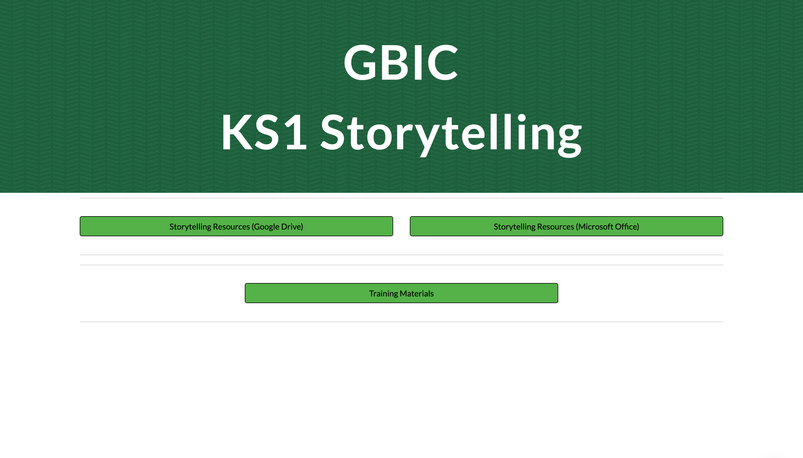

## Session 2: KS1 'Storytelling' training – Getting started
Session 2 introduces you to the online 'Storytelling' resources through links, video, and tasks. There are two tasks in this session. The second task focuses on completing a lesson that the pupils themselves undertake.

## Accessing the 'Storytelling' resources
In this session, you are going to focus on the lesson resources that you will need for the Teaching Approach trial. You will have an opportunity to explore all the resources yourself, try them out, and think about how to implement the lessons in your classroom.

The session introduces you to the ['Storytelling' resource portal](http://ncce.io/KS1Storytelling), where you can explore all the resources for Units 1 and 2 of the 'Storytelling' Teaching Approach trial. Here you can access the resources online in Google Docs and Google Slides, or you can download the resources as Microsoft Word and Microsoft PowerPoint files.

You can also find links to all of the resources in your [Project guide](https://ncce.io/k2zQga) and [Units overview](https://ncce.io/glxPE8), and you can also access them via [Google Drive](https://ncce.io/l9Spga).

The resources consist of two subfolders and three documents. Feel free to download the resources or access them each time you need them from this webpage. You may wish to bookmark the link to the resources in the browser toolbar of your tablet/iPad/computer for ease of reference in the classroom. 

The resources prepared for the trial period include twelve one-hour lessons. You will implement the teaching approach within fully resourced lessons: six lessons on story-writing and six lessons on digital storytelling.

Click the green button (below right) to go to the next step in this session.

You can go back to the [list of contents for this session (Session 2) here](https://projects.raspberrypi.org/en/projects/KS1StorytellingTraining_Session2_GBICi1b). 
You can access the [menu for Sessions 1, 2, and 3 here](https://projects.raspberrypi.org/en/pathways/ks1-storytellingtraining-gbici1b).
