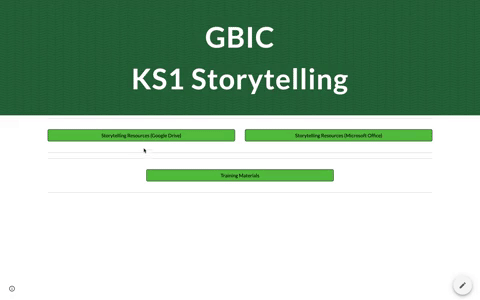

## Part 1 Investigate online Storytelling resources
Part 1 introduces you to the online Storytelling resources through links, video and tasks. There are 2 tasks in Part 1.

## Accessing the Storytelling resources
In this session, you are going to focus on the lesson resources you will need for the Teaching Approach trial. You will have an opportunity to explore all the resources for yourself, try them out and think about how to implement the lessons in your own classroom.

Part 1 of this session introduces you to the [Storytelling Resource portal](http://ncce.io/KS1Storytelling) where you can explore all the resources for Unit 1 & 2, Storytelling trial. The webpage is the access portal for all the resources relating to the Storytelling trial. Here you can follow links to Google Docs and Google Slides OR download the resources as Microsoft documents.

Links to all of the resources can also be found in your [Project Guide](https://docs.google.com/document/d/1GCvtNeQWBAr_5M2xajIXmoqcHco7WPEtvMrsf-v4oGI/edit?usp=sharing), [Unit Overview](ncce.io/glxPE8) and also accessed via the [Google Drive](ncce.io/l9Spga).

The resources consist of two sub-folders and three documents. Feel free to download the resources or access them each time you need them from this webpage. You may wish to bookmark the link to the resources in the browser toolbar of the teacher’s tablet/iPad/computer for ease of reference. 

The resources prepared for the trial period include twelve 1-hour lessons. You will implement the teaching approach within fully-resourced lessons: six weeks on Story-writing and six weeks on Digital Storytelling.

