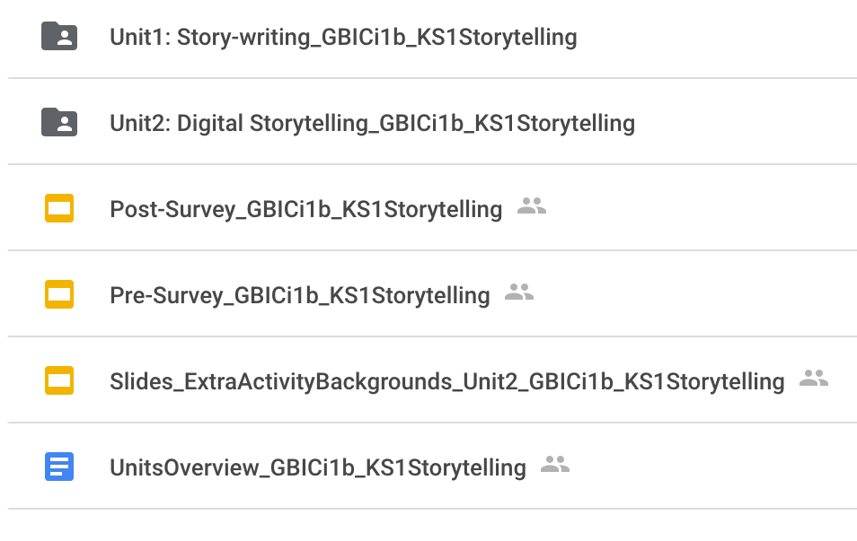
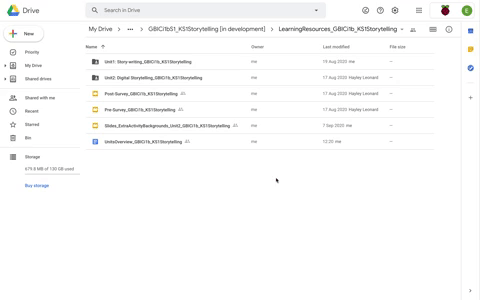

## The resources

The teaching resource folder includes:
+ Units overview (text document)
+ Unit 1 – Story-writing (folder)
+ Unit 2 – Storytelling (folder)
+ Pre-survey (presentation slide)
+ Post-survey (presentation slide)
+ Extra activity: Backgrounds (presentation slide)

{:width="400px"}

You will use ScratchJr to teach key programming concepts to produce interactive animations. The resources for the 12-week trial are written for both the ScratchJr app and an emulator. Pupils do not need to be familiar with programming at the start of the trial. Educators should be familiar with the ScratchJr interface, blocks, and Programming Area, as well as characters. Detailed instructions for completing each task are provided in the lesson plans, so educators who are less familiar with ScratchJr are able to practise in advance when preparing for the lessons. Session 2 focuses on building up your expertise in ScratchJr and your familiarity with the resources.

You can see in the Units overview that the first topic consists of six lessons in a unit about story-writing. Each lesson gradually introduces pupils to the ScratchJr environment and the blocks that can be used to construct stories.

The second topic outlined in the Units overview consists of six lessons in a unit about digital storytelling. The lessons form a journey that starts with exploring interactive animation tools. Over the course of the unit, learners will explore the programming concepts of sequencing, selection, and repetition through the control of characters to produce a storyboard for a digital story.

You will find the lesson plans, slides, and associated resources in separate folders for Unit 1 – 'Story-writing' and Unit 2 – 'Digital storytelling'.
Within each of the unit folders, you will find subfolders for all of the individual lessons and their associated resources.

These documents are all the resources you need to participate in the Teaching Approach trial.

Click the green button (below right) to go to the next step in this session.

You can go back to the [list of contents for this session (Session 2) here](https://projects.raspberrypi.org/en/projects/KS1StorytellingTraining_Session2_GBICi1b). 
You can access the [menu for Sessions 1, 2, and 3 here](https://projects.raspberrypi.org/en/pathways/ks1-storytellingtraining-gbici1b).
