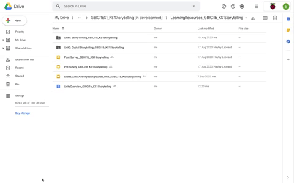

## The Units overview

The first document that you need to read is the Units overview, which provides essential information relating to the 'Storytelling' Teaching Approach trial, including details on preparing to deliver the lessons.

You will see that each lesson is set out with a brief description and the learning objectives and success criteria for that lesson. The overview also includes links to the relevant lesson plans and resources. 

You will note that some of the information in the Units overview, such as information about the surveys, has been covered elsewhere in the training sessions. The Units overview offers a useful place to go as a signpost and reminder of key considerations. The document includes information about the following:
+ Resources
+ Subject knowledge
+ ScratchJr 
+ Devices and live demonstration
+ Surveys

Click the green button (below right) to go to the next step in this session.

You can go back to the [list of contents for this session (Session 2) here](https://projects.raspberrypi.org/en/projects/KS1StorytellingTraining_Session2_GBICi1b). 
You can access the [menu for Sessions 1, 2, and 3 here](https://projects.raspberrypi.org/en/pathways/ks1-storytellingtraining-gbici1b).
