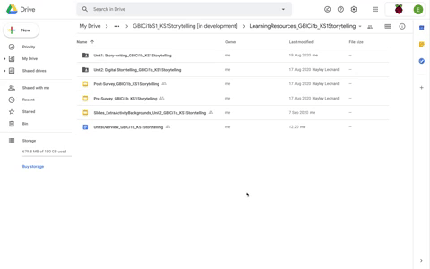
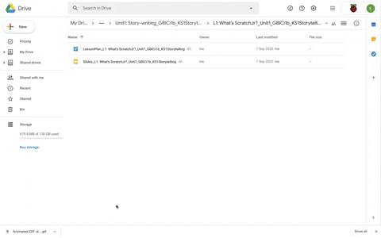

## Lesson plans and presentation slides
Now that you have read the Units overview and undertaken Unit 1 – Lesson 1, you will explore the 11 lessons in turn. Each lesson includes a lesson plan and presentation slides.

You are now going to have the opportunity to explore the learning resources independently. You should take time now within the course to:
+ Get to grips with the units as a whole
+ Consider how you can best implement the 'Storytelling' approach in your own classroom with your learners

This is a good opportunity to familiarise yourself with the ScratchJr tasks provided. We suggest that you take around an hour now to access and explore the resources, and then return to this course for the final pieces of information about data collection and ongoing support.

**Lesson plans**
All the lesson plans are structured in a consistent way with the following subheadings:
+ Lesson overview
+ Learning objectives
+ Success criteria
+ Key vocabulary
+ Assessment opportunities
+ Preparation: subject knowledge and what you will need for the lesson

The table in the Outline plan breaks down the delivery of the lesson into timed activities that correlate with the presentation slides. (Note that the presentation slides label the activities in the top right-hand corner to help you navigate the lesson.)

Work your way through each lesson, exploring the lesson plan and its relationship to the presentation slides. Allowing yourself time for preparation now will give you the best chance to incorporate the 'Storytelling' teaching approach into your lessons when the project begins. 

**Presentation slides**
All the presentation slides are structured in a consistent way, beginning with a lesson objective and success criteria. This introduction is followed by the lesson activities. The last three slides of every lesson's presentation slides always include the following slides: a plenary, an assessment of the pupils' confidence, and details of the next lesson.

Investigate the resources.

Make a note of anything that you need to clarify. You can use the feedback form to ask questions to the project community. You can also get in touch with us by email if you have any queries at any time before, during, or after the project via [genderresearch@raspberrypi.org](mailto:genderresearch@raspberrypi.org).

Part two of this session explores two lessons in detail, giving you the opportunity to develop a working understanding of the relationship between the lesson plans and the presentation slides, and to experience the lessons from the pupils' perspective. You will begin to code in ScratchJr and develop an interactive animation.

You can access the [next session (Session 3) here](https://projects.raspberrypi.org/en/projects/KS1StorytellingTraining_Session3_GBICi1b).

You can go back to the [list of contents for this session (Session 2) here](https://projects.raspberrypi.org/en/projects/KS1StorytellingTraining_Session2_GBICi1b). 
You can access the [menu for Sessions 1, 2, and 3 here](https://projects.raspberrypi.org/en/pathways/ks1-storytellingtraining-gbici1b).

**Note: Please do not click the green 'What's next?' button (below right) as this link is not relevant to this training course.**
